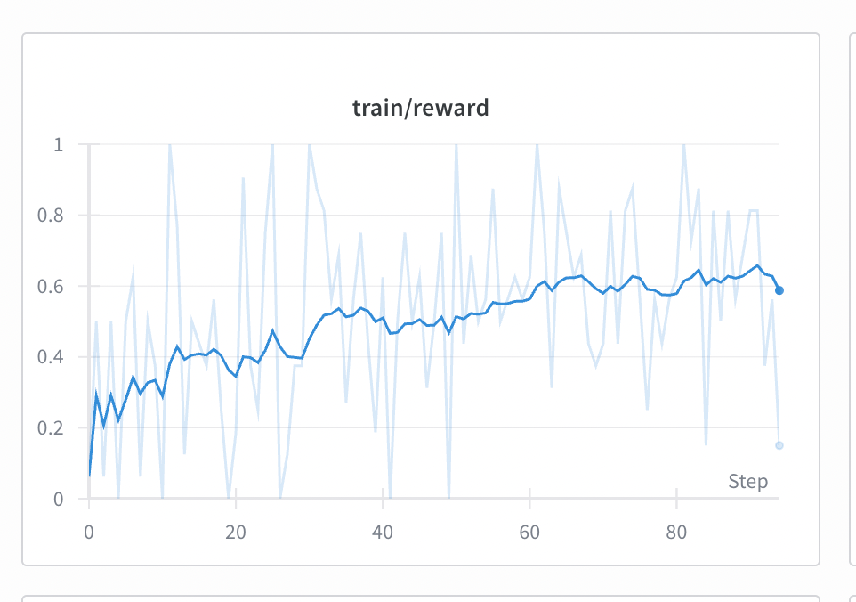
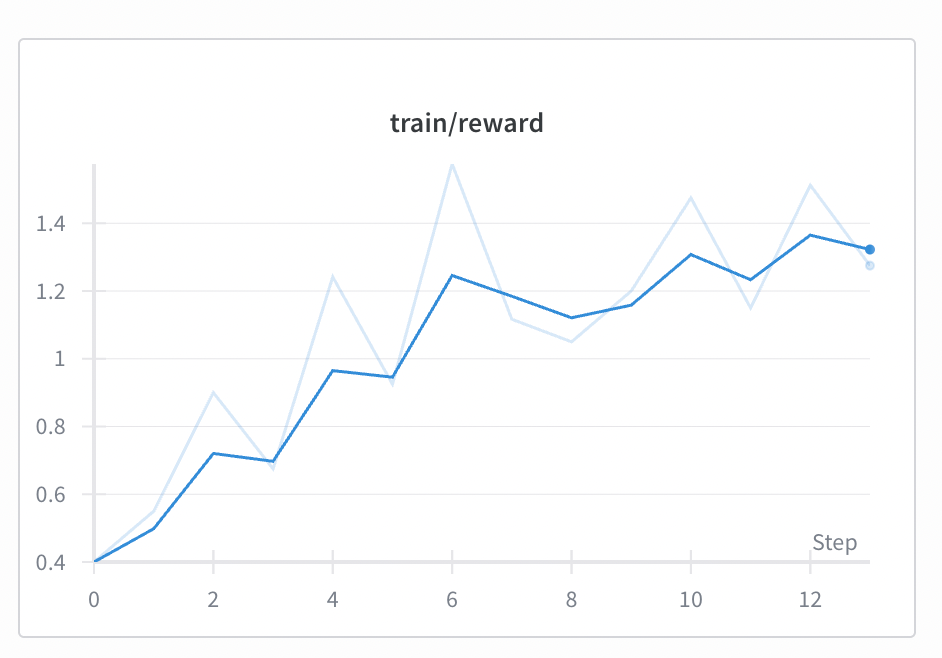
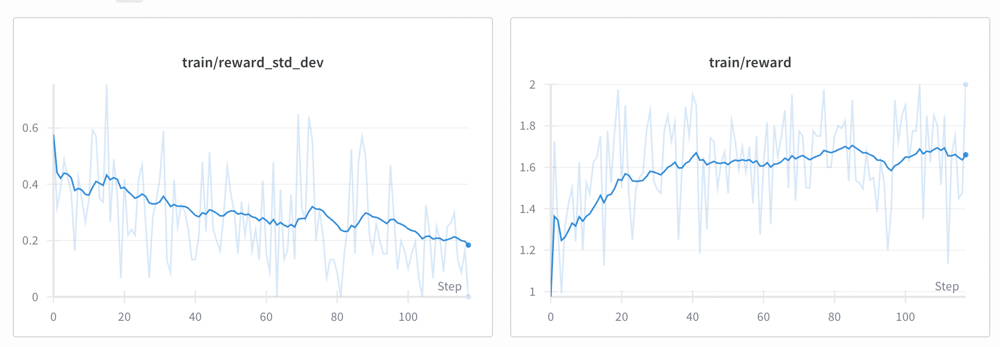
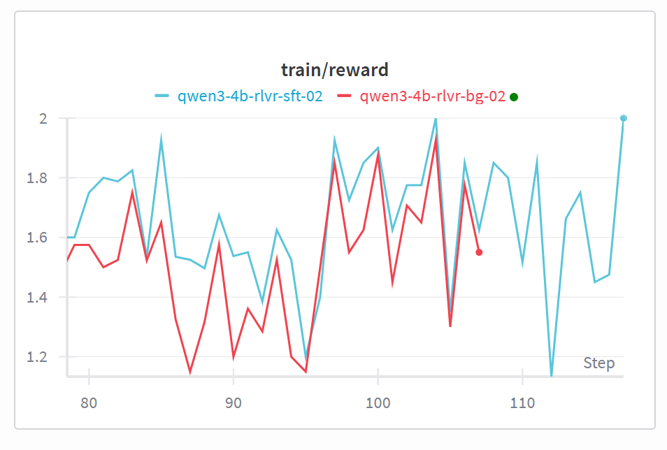
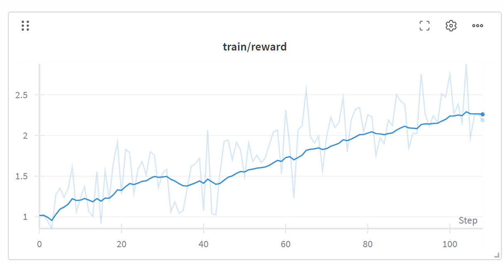
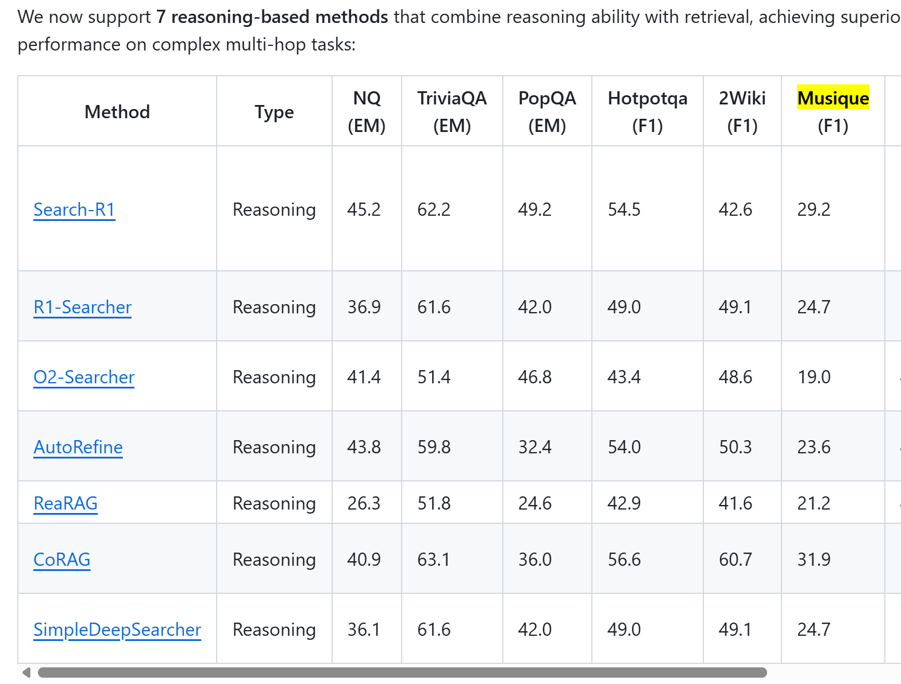

# DeepSearch-RL

DeepSearch-RL is a reinforcement learning project for train a RAG Agent.

## Setup Environment

如下环境用于检索服务、Agent以及模型 SFT 训练。

```bash
git submodule update --init --recursive
conda create -n deepsearch-rl python=3.12
conda activate deepsearch-rl
python -m pip install --upgrade pip
pip install packaging ninja numpy pandas ipython ipykernel gdown wheel setuptools
pip install -r requirements.txt
# 在国内为避免下载wheel失败，强制构建。
# 如果不想构建，可以自行去 https://github.com/Dao-AILab/flash-attention/releases 下载对应版本的wheel。
#FLASH_ATTENTION_FORCE_BUILD=TRUE MAX_JOBS=16 pip install flash-attn --no-build-isolation
# 如果有国际互联网条件，直接
pip install flash-attn --no-build-isolation

cd FlashRAG/
pip install -e .
cd ../

pip install -r requirements.txt

#下载需要的模型
# 国内使用镜像站
# export HF_ENDPOINT=https://hf-mirror.com
huggingface-cli download --resume-download intfloat/e5-base-v2 --local-dir models/e5-base-v2
huggingface-cli download --resume-download Qwen/Qwen3-4B-Instruct-2507 --local-dir models/Qwen3-4B-Instruct-2507 
huggingface-cli download --resume-download Qwen/Qwen3-4B-Thinking-2507 --local-dir models/Qwen3-4B-Thinking-2507
huggingface-cli download --resume-download Qwen/Qwen3-1.7B --local-dir models/Qwen3-1.7B
-```
```

## 1. Download corpus dataset and setup MCP server

### 1.1 【完成】wiki-18 数据集

参见 data/wiki-18/README.md

### 1.2 【待办】GraphRAG-Bench 数据集

参见 data/GraphRAG-Bench/README.md

### 1.3 【完成】MultiHop-RAG 数据集

参见 data/MultiHop-RAG/README.md

准备好后，启动 MCP 服务

```bash
cd data/MultiHop-RAG/
# follow the README.md to prepare data.
python ../retriever_mcp.py \
    --vector_index_path _data/e5_Flat.index \
    --bm25_index_path _data/bm25/ \
    --model_path ../wiki_retriever_mcp/_data/e5-base-v2 \
    --instruction "query: " \
    --corpus_path _data/chunks.jsonl \
    --use_multi_retriever \
    --merge_method rrf \
    --device cpu \
    --top_k 3
```

TODO：优化 Search MCP 的返回，更非结构一些。

## 2. Agent DeepSearch 实现 & 评测

基于OpenAI Agents SDK 开发最简单的 DeepSearch 实现。

评测 MultiHop-RAG 数据集，我们选择两个 Prompt：

- MultiHop-RAG：适合 Thinking 模型，参考 https://github.com/microsoft/agent-lightning/blob/main/examples/rag/rag_agent.py
- MultiHop-RAG-NoThink：适合 No-Thinking 模型（在多轮函数调用时没有思考过程）。

此外服务端默认支持并行工具调用。

```bash
# 需要对应的模型支持 Function callings
# 写入api_key base_url 到 .env
# 这里的模型填你的服务商的 model 名称。
model="openrouter/qwen/qwen3-30b-a3b-instruct-2507"
model_name=`echo $model | tr '/:' '-'`
prompt_name="MultiHop-RAG-NoThink"
# 运行 Agent，从 .env 读取 base_url 和 api_key
python deepsearch_agent.py run --prompt-name "$prompt_name" --dataset ./data/MultiHop-RAG/_data/val.jsonl --do_eval --model "$model" --output_dir output/"$prompt_name"/"$model_name"
# 分析日志，得到抽取的Tool calling 数据集
python analyze_trajectory.py --output_dir output/"$prompt_name"/"$model_name" --with_eval
# 日志输出到 trajectory.jsonl 文件，这个文件可以用来训练和评估模型
```

小模型启动命令：

```bash
# vllm 在 deepsearch-rl-vllm 环境中启动，避免冲突
vllm serve models/Qwen3-4B-Instruct-2507 --max-model-len 90000 --enable-auto-tool-choice --tool-call-parser hermes

model="models/Qwen3-4B-Instruct-2507"
model_name=`echo $model | tr '/:' '-'`
prompt_name="MultiHop-RAG-NoThink"
# prompt_name="MultiHop-RAG"
python deepsearch_agent.py run --base_url http://localhost:8000/v1 --api_key EMPTY --prompt-name "$prompt_name" --dataset ./data/MultiHop-RAG/_data/val.jsonl --do_eval --model "$model" --output_dir output/"$prompt_name"/"$model_name"
python analyze_trajectory.py --output_dir output/"$prompt_name"/"$model_name" --with_eval
```


```bash
vllm serve models/Qwen3-4B-Thinking-2507 --max-model-len 90000 --enable-auto-tool-choice --tool-call-parser hermes --reasoning-parser deepseek_r1
model="models/Qwen3-4B-Thinking-2507"
model_name=`echo $model | tr '/:' '-'`
prompt_name="MultiHop-RAG-NoThink"
python deepsearch_agent.py run --base_url http://localhost:8000/v1 --api_key EMPTY --prompt-name "$prompt_name" --dataset ./data/MultiHop-RAG/_data/val.jsonl --do_eval --model "$model" --output_dir output/"$prompt_name"/"$model_name"
python analyze_trajectory.py --output_dir output/"$prompt_name"/"$model_name" --with_eval

model="models/Qwen3-4B-Thinking-2507"
model_name=`echo $model | tr '/:' '-'`
prompt_name="MultiHop-RAG"
python deepsearch_agent.py run --base_url http://localhost:8000/v1 --api_key EMPTY --prompt-name "$prompt_name" --dataset ./data/MultiHop-RAG/_data/val.jsonl --do_eval --model "$model" --output_dir output/"$prompt_name"/"$model_name"
python analyze_trajectory.py --output_dir output/"$prompt_name"/"$model_name" --with_eval
```

| 模型 | Prompt | topK | chunk_size(tokens) | 结果（F1） |
| --- | --- | --- | --- | --- | 
| Qwen3-4B-Instruct-2507 | MultiHop-RAG-NoThink | 3 | 200 | 0.521 |
| Qwen3-4B-Instruct-2507 | MultiHop-RAG | 3 | 200 | 0.453 |
| Qwen3-4B-Thinking-2507 | MultiHop-RAG-NoThink | 3 | 200 | 0.458 |
| Qwen3-4B-Thinking-2507 | MultiHop-RAG | 3 | 200 | 0.385 |
| openrouter/qwen/qwen3-30b-a3b-instruct-2507 | MultiHop-RAG-NoThink |3 | 200 | 0.678 |
| openrouter/qwen/qwen3-30b-a3b-instruct-2507 | MultiHop-RAG |3 | 200 | 0.583 |

还是 NoThink Prompt 比较好，后续不管思考模型还是非思考模型都用这个 Prompt

## 3. 合成 Agent 轨迹，对小模型进行 SFT

挑选 Qwen3-4B-Instruct-2507 / Qwen3-4B-Thinking-2507模型，对其进行 SFT

1. 使用 qwen3-30B 模型合成轨迹，并过滤出正确的轨迹。
2. 使用 ms-swift 进行 SFT
3. 评估 SFT 效果。

### 3.1 Non-Thinking 数据合成

```bash
model="openrouter/qwen/qwen3-30b-a3b-instruct-2507"
model_name=`echo $model | tr '/:' '-'`
prompt_name="MultiHop-RAG-NoThink"
python deepsearch_agent.py run --prompt-name "$prompt_name" --dataset ./data/MultiHop-RAG/_data/train.jsonl --do_eval --model "$model" --output_dir output/train/"$prompt_name"/"$model_name"
python analyze_trajectory.py --output_dir output/train/"$prompt_name"/"$model_name" --with_eval

# 过滤出1504条成功的轨迹
Evaluation results: {'em': 0.6370967741935484, 'f1': 0.6417889788008634, 'acc': 0.6481324278438031, 'precision': 0.642225
5234861347, 'recall': 0.6426651305683564}

                         Conversation Dynamics
┏━━━━━━━━━━━━━━━━━━━━━━━━━━━┳━━━━━━━━━━━━━┳━━━━━━━━━━━━━┳━━━━━━━━━━━━━┓
┃ Metric                    ┃         All ┃     Success ┃     Failure ┃
┡━━━━━━━━━━━━━━━━━━━━━━━━━━━╇━━━━━━━━━━━━━╇━━━━━━━━━━━━━╇━━━━━━━━━━━━━┩
│ Avg Rounds                │ 3.37 ± 0.97 │ 3.26 ± 0.96 │ 3.57 ± 0.96 │
│ Avg Tool Calls            │ 2.51 ± 0.93 │ 2.37 ± 0.93 │ 2.77 ± 0.89 │
└───────────────────────────┴─────────────┴─────────────┴─────────────┘
                    Token Usage (Last Turn)
┏━━━━━━━━━━━━━━━━━━━━━━┳━━━━━━━━━━━━┳━━━━━━━━━━━━┳━━━━━━━━━━━━┓
┃ Metric               ┃        All ┃    Success ┃    Failure ┃
┡━━━━━━━━━━━━━━━━━━━━━━╇━━━━━━━━━━━━╇━━━━━━━━━━━━╇━━━━━━━━━━━━┩
│ Total                │ 2211 ± 699 │ 2096 ± 687 │ 2415 ± 673 │
│ Prompt               │ 2176 ± 698 │ 2067 ± 683 │ 2368 ± 683 │
│ Completion           │    35 ± 59 │    28 ± 60 │    47 ± 55 │
└──────────────────────┴────────────┴────────────┴────────────┘
               Token Usage (All Turns - Cumulative)
┏━━━━━━━━━━━━━━━━━━━━━━┳━━━━━━━━━━━━━┳━━━━━━━━━━━━━┳━━━━━━━━━━━━━┓
┃ Metric               ┃         All ┃     Success ┃     Failure ┃
┡━━━━━━━━━━━━━━━━━━━━━━╇━━━━━━━━━━━━━╇━━━━━━━━━━━━━╇━━━━━━━━━━━━━┩
│ Total                │ 4726 ± 2503 │ 4391 ± 2395 │ 5318 ± 2580 │
│ Prompt               │ 4594 ± 2471 │ 4271 ± 2362 │ 5163 ± 2556 │
│ Completion           │    132 ± 78 │    120 ± 74 │    155 ± 81 │
└──────────────────────┴─────────────┴─────────────┴─────────────┘

                  Round Distribution
┏━━━━━━━━━━┳━━━━━━━━━━━━━┳━━━━━━━━━━━━━┳━━━━━━━━━━━━━┓
┃  Rounds  ┃         All ┃     Success ┃     Failure ┃
┡━━━━━━━━━━╇━━━━━━━━━━━━━╇━━━━━━━━━━━━━╇━━━━━━━━━━━━━┩
│    2     │ 497 (21.1%) │ 380 (25.3%) │ 117 (13.7%) │
│    3     │ 824 (35.0%) │ 525 (34.9%) │ 299 (35.1%) │
│    4     │ 710 (30.1%) │ 436 (29.0%) │ 274 (32.2%) │
│    5     │ 317 (13.5%) │ 159 (10.6%) │ 158 (18.5%) │
│    6     │    8 (0.3%) │    4 (0.3%) │    4 (0.5%) │
└──────────┴─────────────┴─────────────┴─────────────┘
                 Tool Calls Distribution
┏━━━━━━━━━━━━━━┳━━━━━━━━━━━━━┳━━━━━━━━━━━━━┳━━━━━━━━━━━━━┓
┃  Tool Calls  ┃         All ┃     Success ┃     Failure ┃
┡━━━━━━━━━━━━━━╇━━━━━━━━━━━━━╇━━━━━━━━━━━━━╇━━━━━━━━━━━━━┩
│      1       │ 280 (11.9%) │ 263 (17.5%) │   17 (2.0%) │
│      2       │ 982 (41.7%) │ 608 (40.4%) │ 374 (43.9%) │
│      3       │ 734 (31.2%) │ 459 (30.5%) │ 275 (32.3%) │
│      4       │ 337 (14.3%) │ 164 (10.9%) │ 173 (20.3%) │
│      5       │    9 (0.4%) │    6 (0.4%) │    3 (0.4%) │
│      6       │   14 (0.6%) │    4 (0.3%) │   10 (1.2%) │
└──────────────┴─────────────┴─────────────┴─────────────┘
```

### 3.2 Non-Thinking 模型训练和评估

```bash
python convert_tool_calling_dataset.py --type swift --input_path output/train/MultiHop-RAG-NoThink/openrouter-qwen-qwen3-30b-a3b-instruct-2507/trajectory_success.jsonl  --output_path output/train/MultiHop-RAG-NoThink/openrouter-qwen-qwen3-30b-a3b-instruct-2507/trajectory_success_swift.jsonl

swift sft \
    --model models/Qwen3-4B-Instruct-2507 \
    --dataset output/train/MultiHop-RAG-NoThink/openrouter-qwen-qwen3-30b-a3b-instruct-2507/trajectory_success_swift.jsonl\
    --load_from_cache_file true \
    --train_type lora \
    --lora_r 64 \
    --lora_alpha 128 \
    --lora_dropout 0.05 \
    --target_modules all-linear \
    --agent_template hermes \
    --torch_dtype bfloat16 \
    --num_train_epochs 2 \
    --per_device_train_batch_size 1 \
    --per_device_eval_batch_size 1 \
    --learning_rate 1e-4 \
    --weight_decay 0.1 \
    --gradient_accumulation_steps 8 \
    --gradient_checkpointing true \
    --gradient_checkpointing_kwargs '{"use_reentrant": false}' \
    --report_to tensorboard \
    --do_eval true \
    --split_dataset_ratio 0.05 \
    --eval_steps 10 \
    --save_strategy steps \
    --save_steps 10 \
    --save_total_limit 10 \
    --logging_steps 1 \
    --max_length 8192 \
    --save_only_model true \
    --packing true \
    --output_dir output/lora/ \
    --warmup_ratio 0.05 \
    --lr_scheduler_type cosine \
    --attn_impl flash_attn \
    --dataloader_num_workers 4 \
    --dataset_num_proc 16 \
    --use_liger_kernel true

# 启动 tensorboard
tensorboard --logdir output/lora/
```

启动推理
```bash
# 使用 --enforce-eager 不加载 CUDA Graph，提升启动速度,同时可以加载多个lora modules
vllm serve models/Qwen3-4B-Instruct-2507 --enforce-eager \
    --max-model-len 32768 --enable-auto-tool-choice --tool-call-parser hermes \
    --enable-lora --max-lora-rank 64 \
    --lora-modules 4b-sft-cpkt96=output/lora/v1-20251003-202557/checkpoint-96


model=4b-sft-cpkt96
model_name=`echo $model | tr '/:' '-'`
prompt_name="MultiHop-RAG-NoThink"
python deepsearch_agent.py run --base_url http://localhost:8000/v1 --api_key EMPTY --prompt-name "$prompt_name" --dataset ./data/MultiHop-RAG/_data/val.jsonl --do_eval --model "$model" --output_dir output/"$prompt_name"/"$model_name"
python analyze_trajectory.py --output_dir output/"$prompt_name"/"$model_name" --with_eval
```

比对微调前后，有较大提升

| 模型 | Prompt | topK | chunk_size(tokens) | 结果（F1） |
| --- | --- | --- | --- | --- | 
| Qwen3-4B-Instruct-2507 | MultiHop-RAG-NoThink | 3 | 200 | 0.521 |
| 4b-sft-cpkt96 | MultiHop-RAG-NoThink |3 | 200 | 0.751 |

比较轮次和工具使用，发现微调后，轮次和工具调用的数据量都有所增长。

```bash
# 微调前
                         Conversation Dynamics
┏━━━━━━━━━━━━━━━━━━━━━━━━━━━┳━━━━━━━━━━━━━┳━━━━━━━━━━━━━┳━━━━━━━━━━━━━┓
┃ Metric                    ┃         All ┃     Success ┃     Failure ┃
┡━━━━━━━━━━━━━━━━━━━━━━━━━━━╇━━━━━━━━━━━━━╇━━━━━━━━━━━━━╇━━━━━━━━━━━━━┩
│ Avg Rounds                │ 2.37 ± 0.70 │ 2.34 ± 0.68 │ 2.39 ± 0.73 │
│ Avg Tool Calls            │ 1.96 ± 1.04 │ 1.81 ± 1.10 │ 2.11 ± 0.95 │
└───────────────────────────┴─────────────┴─────────────┴─────────────┘
                 Round Distribution
┏━━━━━━━━━━┳━━━━━━━━━━━━━┳━━━━━━━━━━━━┳━━━━━━━━━━━━┓
┃  Rounds  ┃         All ┃    Success ┃    Failure ┃
┡━━━━━━━━━━╇━━━━━━━━━━━━━╇━━━━━━━━━━━━╇━━━━━━━━━━━━┩
│    2     │ 153 (76.5%) │ 80 (77.7%) │ 73 (75.3%) │
│    3     │  21 (10.5%) │ 11 (10.7%) │ 10 (10.3%) │
│    4     │  26 (13.0%) │ 12 (11.7%) │ 14 (14.4%) │
└──────────┴─────────────┴────────────┴────────────┘
                Tool Calls Distribution
┏━━━━━━━━━━━━━━┳━━━━━━━━━━━━┳━━━━━━━━━━━━┳━━━━━━━━━━━━┓
┃  Tool Calls  ┃        All ┃    Success ┃    Failure ┃
┡━━━━━━━━━━━━━━╇━━━━━━━━━━━━╇━━━━━━━━━━━━╇━━━━━━━━━━━━┩
│      1       │ 88 (44.0%) │ 59 (57.3%) │ 29 (29.9%) │
│      2       │ 55 (27.5%) │ 18 (17.5%) │ 37 (38.1%) │
│      3       │ 37 (18.5%) │ 15 (14.6%) │ 22 (22.7%) │
│      4       │  18 (9.0%) │   9 (8.7%) │   9 (9.3%) │
│      5       │   2 (1.0%) │   2 (1.9%) │   0 (0.0%) │
└──────────────┴────────────┴────────────┴────────────┘
# 微调后
Conversation Dynamics

| Metric | All | Success | Failure |
|--------|-----|---------|---------|
| Avg Rounds | 3.35 ± 0.90 | 3.34 ± 0.94 | 3.41 ± 0.75 |
| Avg Tool Calls | 2.35 ± 0.90 | 2.34 ± 0.94 | 2.41 ± 0.75 |

Round Distribution
┏━━━━━━━━━━┳━━━━━━━━━━━━┳━━━━━━━━━━━━┳━━━━━━━━━━━━┓
┃  Rounds  ┃        All ┃    Success ┃    Failure ┃
┡━━━━━━━━━━╇━━━━━━━━━━━━╇━━━━━━━━━━━━╇━━━━━━━━━━━━┩
│    2     │ 33 (16.5%) │ 29 (19.5%) │   4 (7.8%) │
│    3     │ 87 (43.5%) │ 61 (40.9%) │ 26 (51.0%) │
│    4     │ 56 (28.0%) │ 39 (26.2%) │ 17 (33.3%) │
│    5     │ 24 (12.0%) │ 20 (13.4%) │   4 (7.8%) │
└──────────┴────────────┴────────────┴────────────┘
                Tool Calls Distribution
┏━━━━━━━━━━━━━━┳━━━━━━━━━━━━┳━━━━━━━━━━━━┳━━━━━━━━━━━━┓
┃  Tool Calls  ┃        All ┃    Success ┃    Failure ┃
┡━━━━━━━━━━━━━━╇━━━━━━━━━━━━╇━━━━━━━━━━━━╇━━━━━━━━━━━━┩
│      1       │ 33 (16.5%) │ 29 (19.5%) │   4 (7.8%) │
│      2       │ 87 (43.5%) │ 61 (40.9%) │ 26 (51.0%) │
│      3       │ 56 (28.0%) │ 39 (26.2%) │ 17 (33.3%) │
│      4       │ 24 (12.0%) │ 20 (13.4%) │   4 (7.8%) │
└──────────────┴────────────┴────────────┴────────────┘
```

### 3.3 Thinking 数据合成

TODO：使用 Thinking 模型合成

### 3.4 Thinking 模型训练和评估

Thinking 模型训练的问题是会Chat Template 会删除掉历史 Thinking 信息，需要将多轮调用打平成单轮调用以保留 Thinking 信息。

分别测试不打平和打平两种实现方式的效果。


## 4. 使用 RL 进行模型训练

挑选 Qwen3-4B-Thinking-2507 / Qwen3-4B-Instruct-2507 模型，对其进行 RL 训练，使用 Lora 训练

### 4.2 OpenPipe-ART

#### 4.2.1 Non-Thinking Model RL

没有使用LLM的评分，而是使用绝对评分。

```bash
conda create -n openpipe-art python=3.12
conda activate openpipe-art
cd ART && pip install -e .[backend]
pip install "openai-agents==0.3.3" flashinfer-python

# 使用的 GSPO
python art_rollout.py train "models/Qwen3-4B-Instruct-2507" "qwen3-4b-rlvr-111" --max_seq_length 8192 --max_tokens 4096 --gpu_memory_utilization 0.6
# 配置8192 限制就会限制总的轮次，如果输入超长就会400错误，奖励为0
# max_seq_length - max_tokens 为 prompt_length，超出后 vllm 会报错

# 默认参数在 https://github.com/OpenPipe/ART/blob/main/src/art/dev/get_model_config.py
# 通过 https://github.com/OpenPipe/ART/blob/main/src/art/dev/model.py 中的内容进行修改。
```

问题1：OpenPipe-ART 目前有bug，就是训练可能会卡住。具体 issue：
- https://github.com/OpenPipe/ART/issues/346
- （猜测）怀疑可能是和Unsloth的 Sleep 模式有关，增加 disable_sleep_mode 尝试解决
    - 设置无效，这里貌似强制写死为 True：https://github.com/OpenPipe/ART/blob/main/src/art/vllm/engine.py#L46
    - 修改代码如下
            
        ```python
        diff --git a/src/art/vllm/engine.py b/src/art/vllm/engine.py
        index 7bba9f0..a0122e4 100644
        --- a/src/art/vllm/engine.py
        +++ b/src/art/vllm/engine.py
        @@ -43,7 +43,7 @@ async def get_llm(args: vllm.AsyncEngineArgs) -> AsyncLLM:
                replace(
                    args,
                    worker_extension_cls=f"{WorkerExtension.__module__}.{WorkerExtension.__qualname__}",
        -            enable_sleep_mode=True,
        +            # enable_sleep_mode=True,
                )
            )
            await run_on_workers(llm, patch_allocator)
        ```
    - 设置后还是卡住，不进行修改
- （尝试，失败）使用 --decouple_vllm_and_unsloth 拆分 vllm 和 Unsloth，以验证是否正常。报错 `AssertionError: Expandable segments are not compatible with memory pool.`，需要设置 disable_sleep_mode 为 True（配合代码修改）。还是会卡在 train

问题2: 如何断点续训（数据集也会自动从断点继续）

解决办法：
1. 直接重复执行命令，会从最后一个step继续训练
2. 使用如下命令指定 step 继续训练
```bash
python art_rollout.py train "models/Qwen3-4B-Instruct-2507" "qwen3-4b-rlvr-04" --max_seq_length 8192 --resume_ckpt "qwen3-4b-rlvr-03:94"

Iterating dataset:   8%|█████▍                                                              | 94/1178 [00:00<?, ?batch/s]
Gathering trajectory groups with RULER scoring...
train gather step 94:  94%|████████████████████████▍ | 15/16 [00:13<00:00,  2.91it/s, reward=0.611, completion_token
```

问题3：`openai.NotFoundError: Error code: 404 - {'detail': 'Not Found'}`
- 来自 LocalBackend._monitor_openai_server()，是用来监控 OpenAI Server 是否准备的，不影响训练。

问题4：Prompt 经常超限导致模型请求失败，此时奖励为0，和格式正确无法区分。所以增加格式奖励为0.5，正确性奖励为2。

问题5： 偶发出现训练变得特别慢，怀疑是显存不足offload导致的
```bash
Packed 56 trajectories into 26 sequences of length 8192
train:   4%|███▎  | 1/26 [08:49<3:40:37, 529.48s/it, loss=-0.538, grad_norm=0.385, policy_loss=-0.538, entropy=0.285]
```

**只有正确性奖励（0-1，后面正确性奖励都改成了0-2）时的 reward 曲线，可以见到收敛缓慢。**

`python art_rollout.py train "models/Qwen3-4B-Instruct-2507" "qwen3-4b-rlvr-103" --max_seq_length 8192 --max_tokens 3072 --gpu_memory_utilization 0.6 --rewards correct`


**格式奖励（0.5） + 正确性奖励（0-2）时的 reward 曲线，效果达到峰值后下降。**
`python art_rollout.py train "models/Qwen3-4B-Instruct-2507" "qwen3-4b-rlvr-111" --max_seq_length 8192 --max_tokens 4096 --gpu_memory_utilization 0.6 --rewards correct,answer_format`


**大group推理后训练（相当于10*8 = 80 rollouts/step）。**

```bash
python art_rollout.py train "models/Qwen3-4B-Instruct-2507" "qwen3-4b-rlvr-bg-01" --max_seq_length 8192 --max_tokens 3072 --gpu_memory_utilization 0.6 --groups_per_step 10 --gradient_accumulation_steps 4 --rewards correct
## 模型训练时卡住了，修改 gradient_accumulation_steps 为 2 也会报错。感觉是Bug。

python art_rollout.py train "models/Qwen3-4B-Instruct-2507" "qwen3-4b-rlvr-bg-02" --max_seq_length 8192 --max_tokens 3072 --gpu_memory_utilization 0.6 --groups_per_step 10 --gradient_accumulation_steps 1 --rewards correct
```

大的batch会减少训练过程中切换推理和训练的损耗，训练速度更快，同时缓解了局部最优解。但是光增加采样batch，训练batch不变，其实是off-policy的，所以需要用TIS、GSPO这种缓解off-policy的算法。



可以看到很快就到了 65% 左右的正确率。


**SFT + RL**

```bash
python art_rollout.py train "output/lora/v1-20251003-202557/checkpoint-96" "qwen3-4b-rlvr-sft-01" --max_seq_length 8192 --max_tokens 3072 --gpu_memory_utilization 0.4 --rewards correct --groups_per_step 10 --gradient_accumulation_steps 2

# 虽然文档说可以加载 lora 为base_model（https://art.openpipe.ai/getting-started/faq#can-i-start-rl-from-an-existing-sft-lora-adapter） 但是实际报错：[rank0]: TypeError: Unsloth: Your model already has LoRA adapters. Your new parameters are different.
```

```bash
# Merge 模型
conda activate deepsearch-rl
swift export \
    --adapters output/lora/v1-20251003-202557/checkpoint-96 \
    --merge_lora true
mv output/lora/v1-20251003-202557/checkpoint-96-merged models/qwen3-4b-sft-ckpt96

conda activate openpipe-art
# Run RL
python art_rollout.py train "models/qwen3-4b-sft-ckpt96" "qwen3-4b-rlvr-sft-02" --max_seq_length 8192 --max_tokens 3072 --gpu_memory_utilization 0.6 --rewards correct --groups_per_step 10 --gradient_accumulation_steps 1
```

SFT 后 RL，起步的 Reward 就很高。



有意思的是纯RL 到一定 steps，奖励和SFT+RL  同步（相同的数据



最终心得：
1. 使用简单的正确性评分，ART 可以用RLVR，不是非要用 LLM Score
2. 使用大 Group 推理来加速训练（避免推理和训练的来回切换带来的损耗），但是这样就退化为 off-policy，需要用TIS、GSPO等缓解off-policy的算法。（其实相当于 TRL 里的 steps_per_generation 参数，GSPO 默认 4，我们这里设置为10）

##### RL 后的模型推理

OpenPipe-ART 默认使用 Unsloth QLora训练，需要用对应的merge方法（不能用vllm 的 bitandbytes 量化加载，主要是量化的配置不同，unlosth默认是nf4 量化）。

```bash
conda activate openpipe-art
CKPT=0099
LORA_NAME=qwen3-4b-rlvr-sft-02-ckpt${CKPT}-merged

python unsloth_merge_model.py .art/deepsearch-agent-art/models/qwen3-4b-rlvr-sft-02/checkpoints/${CKPT} models/${LORA_NAME}

conda activate deepsearch-rl
vllm serve models/${LORA_NAME} --served-model-name ${LORA_NAME} --enforce-eager \
    --max-model-len 32768 --enable-auto-tool-choice --tool-call-parser hermes 

model=${LORA_NAME}
model_name=`echo $model | tr '/:' '-'`
prompt_name="MultiHop-RAG-NoThink"
python deepsearch_agent.py run --base_url http://localhost:8000/v1 --api_key EMPTY --prompt-name "$prompt_name" --dataset ./data/MultiHop-RAG/_data/val.jsonl --do_eval --model "$model" --output_dir output/"$prompt_name"/"$model_name"
python analyze_trajectory.py --output_dir output/"$prompt_name"/"$model_name" --with_eval

Evaluation results: {'em': 0.855, 'f1': 0.8625, 'acc': 0.86, 'precision': 0.865, 'recall': 0.8616666666666667} 
                         Conversation Dynamics
┏━━━━━━━━━━━━━━━━━━━━━━━━━━━┳━━━━━━━━━━━━━┳━━━━━━━━━━━━━┳━━━━━━━━━━━━━┓
┃ Metric                    ┃         All ┃     Success ┃     Failure ┃
┡━━━━━━━━━━━━━━━━━━━━━━━━━━━╇━━━━━━━━━━━━━╇━━━━━━━━━━━━━╇━━━━━━━━━━━━━┩
│ Avg Rounds                │ 4.88 ± 0.52 │ 4.85 ± 0.54 │ 5.04 ± 0.33 │
│ Avg Tool Calls            │ 3.88 ± 0.52 │ 3.85 ± 0.54 │ 4.04 ± 0.33 │
└───────────────────────────┴─────────────┴─────────────┴─────────────┘
## Round Distribution

| Rounds | All | Success | Failure |
|--------|-----|---------|---------|
| 2 | 1 (0.5%) | 1 (0.6%) | 0 (0.0%) |
| 3 | 9 (4.5%) | 9 (5.2%) | 0 (0.0%) |
| 4 | 7 (3.5%) | 6 (3.5%) | 1 (3.6%) |
| 5 | 179 (89.5%) | 154 (89.5%) | 25 (89.3%) |
| 6 | 4 (2.0%) | 2 (1.2%) | 2 (7.1%) |

## Tool Calls Distribution

| Tool Calls | All | Success | Failure |
|------------|-----|---------|---------|
| 1 | 1 (0.5%) | 1 (0.6%) | 0 (0.0%) |
| 2 | 9 (4.5%) | 9 (5.2%) | 0 (0.0%) |
| 3 | 7 (3.5%) | 6 (3.5%) | 1 (3.6%) |
| 4 | 179 (89.5%) | 154 (89.5%) | 25 (89.3%) |
| 5 | 4 (2.0%) | 2 (1.2%) | 2 (7.1%) |
```

比较下不同模型的效果

| 模型 | Prompt | topK | chunk_size(tokens) | 结果（F1） |
| --- | --- | --- | --- | --- | 
| Kimi/kimi-k2-turbo-preview | MultiHop-RAG-NoThink | 3 | 200 | 0.616 |
| Qwen3-4B-Instruct-2507 | MultiHop-RAG-NoThink | 3 | 200 | 0.521 |
| 4b-sft-cpkt96 | MultiHop-RAG-NoThink |3 | 200 | 0.751 |
| qwen3-4b-rlvr-sft-02-ckpt0099-merged | MultiHop-RAG-NoThink | 3 | 200 | 0.863 |
| qwen3-4b-rlvr-bg-02-ckpt0103-merged | MultiHop-RAG-NoThink | 3 | 200 | 0.831 |

查看 analyze_trajectory.py 输出的结果，模型学会了5次搜索+6轮（超过则超长失败）但是缺乏 thinking 效果。


#### 4.2.2 Thinking Model RL

非思考模型很大的问题是在工具调用之前，模型并没有进行思考（虽然从 Chat Template 上是允许助手在 Function Call 之前输出思考内容，但是在模型Post-training 中很少如此训练）。

我们使用非思考模型 + RL，看模型能否通过工具调用的思考，提升工具调用的效果。

思考模型的RL比较麻烦，因为要控制 format 以及思考长度，所以我们使用较为复杂的格式奖励函数，并使用cosine 惩罚的方法来限制长输出。


```bash
python art_rollout.py train "models/Qwen3-1.7B" "qwen3-1.7b-thinking-rlvr-03" --max_seq_length 8192 --max_tokens 3072 --gpu_memory_utilization 0.6 --groups_per_step 10 --gradient_accumulation_steps 1 --rewards correct,think_format --prompt_name MultiHop-RAG-Thinking
# 效果还不错，在持续提升，但是会造成很长的思维链导致训练特别的慢，其实我们想要的是短小精干的thinking
python art_rollout.py train "models/Qwen3-1.7B" "qwen3-1.7b-thinking-rlvr-short-3" --max_seq_length 8192 --max_tokens 3072 --gpu_memory_utilization 0.6 --groups_per_step 10 --gradient_accumulation_steps 1 --rewards correct,short_think,answer_format --prompt_name MultiHop-RAG-Thinking
```

调试了好几版奖励函数，实现了每轮的short think：


训练曲线也不错，但是因为引入了cosine长度奖励，每组所有rollout基本都会参与训练，所以训练时长大幅提升。不过 100 tokens 比较少，导致思考不充分，可以调整到 300-1000，这样让第一轮思考的长度变长。

这里reward满分是3分，分数减去1除以二可以理解就是score，应该在60+%。




## 4. OOD 评估

我们训练的目标是希望不仅仅在单个数据集上有好的效果，而是希望学会对 MCP 工具的使用，在相关的下游任务上都有较好的效果，我们选择 musique 数据集，使用相同的提示词和工具，验证下模型的工具使用能力能否扩展到其他任务上。

1. 首先去 data/wiki18 目录，根据 README.md 启动服务（注意我们为了规避这个数据集内存占用问题，转换为量化IVFPQ索引，recall@5精度下降为原来的 81.2%，会导致实际效果变差）
2. 下载 Musique/hotpotqa/2wikimultihopqa 数据集 dev 前200条数据

```bash
python -c "import datasets;\
datasets.load_dataset('RUC-NLPIR/FlashRAG_datasets', 'musique', split='dev').select(range(200)).to_json('data/musique/musique_dev_200.jsonl', lines=True, force_ascii=False);\
datasets.load_dataset('RUC-NLPIR/FlashRAG_datasets', 'hotpotqa', split='dev').select(range(200)).to_json('data/hotpotqa/hotpotqa_dev_200.jsonl', lines=True, force_ascii=False);
datasets.load_dataset('RUC-NLPIR/FlashRAG_datasets', '2wikimultihopqa', split='dev').select(range(200)).to_json('data/2wikimultihopqa/2wikimultihopqa_dev_200.jsonl', lines=True, force_ascii=False);\
"
```


| 模型 | Prompt | topK | MultiHopRAG（F1）|  MusiqueDev200（F1）| 2wikiDev200（F1）|
| --- | --- | --- | --- | --- | --- |
| Kimi/kimi-k2-turbo-preview | MultiHop-RAG-NoThink | 3 | 0.616 | 0.428 | 0.473 |
| Qwen3-4B-Instruct-2507 | MultiHop-RAG-NoThink | 3 | 0.521 | 0.139 | 0.222 |
| 4b-sft-cpkt96 | MultiHop-RAG-NoThink |3 | 0.751 | 0.248 | 0.394 |
| qwen3-4b-rlvr-sft-02-ckpt0099-merged | MultiHop-RAG-NoThink | 3 | 0.863 | 0.235 | 0.343 |
| qwen3-4b-rlvr-bg-02-ckpt0103-merged | MultiHop-RAG-NoThink | 3 | 0.831 | 0.237 | 0.389 |

不恰当的和公开论文比较（索引没有对齐，而且没有做musique/2wikimultihopqa全量评测）：



思考：
1. vllm 开启--enforce-eager 在这个case下的性能会相比于不开启要好一些，可能是训练的时候就是开启 enforce-eager（没有用 CudaGraph），所以对齐后性能较好。。
2. OOD 的效果会变差，但是不管是 SFT 还是 RL，都有一定的泛化能力。SFT 意外的泛化效果还不错。
3. 测试 prefix-caching 对效果的影响，发现qwen3-4b-rlvr-sft-02-ckpt0099-merged 开启前 2wikiDev200（F1）为0.335，开启后（默认）为0.343。推理参数对效果有一定的影响。

```bash
# 快速执行评估
bash ./eval.sh Kimi/kimi-k2-turbo-preview 2wikimultihopqa
```


测试下模型的通用能力有没有退化（选择ifeval 指令遵循，是较容易退化的能力）：
```bash
pip install evalscope
evalscope eval \
 --model models/Qwen3-4B-Instruct-2507 \
 --api-url http://127.0.0.1:8000/v1 \
 --api-key EMPTY \
 --eval-type openai_api \
 --datasets ifeval \
 --eval-batch-size 30
```

| 模型 | IFEval(prompt-strict) |
| --- | --- |
| Qwen3-4B-Instruct-2507 | 0.8336 |
| 4b-sft-cpkt96 | 0.8281 |
| qwen3-4b-rlvr-sft-02-ckpt0099-merged | 0.8189 |
| qwen3-4b-rlvr-bg-02-ckpt0103-merged | 0.8373 |

Lora 的好处就是灾难性遗忘较低，但是纯 RL 的好处是基本没有遗忘。

## 5. Prompt Optimization

单独研究一个话题，如果仅依靠 Automate Prompt Optimization 来优化 Prompt，Agent 效果能达到多少。

opik 可以直接对接外部的 Agent，它只关心最终效果，也就是 `opik_agent.py` 和 `opik_agent_optimizer.py`。

但是对于很简单的 Agent（仅依靠 System Prompt的），也可以直接用 `opik_gepa.py` 这种方法来运行。

```bash
pip install opik-optimizer opik

python opik_agent_optimizer.py
```


## 一些bug 

1 离线环境下 unsloth 训练失败。
参见 https://github.com/unslothai/unsloth/issues/3367 修复（降级huggingface-hub）

2 多GPU训练时vllm提示找不到nvcc
export PATH=/usr/local/cuda-12.6/bin/:$PATH

3 如何多GPU训练（使用torchtune）
```python

    # To run on a T4, we need to override some config defaults.
    engine_args = art.dev.EngineArgs(
        enforce_eager=True,
        enable_sleep_mode=not args.disable_sleep_mode,
        tensor_parallel_size=4,
    )
    if args.gpu_memory_utilization:
        engine_args["gpu_memory_utilization"] = args.gpu_memory_utilization

    model._internal_config = art.dev.InternalModelConfig(
        init_args=art.dev.InitArgs(
            max_seq_length=args.max_seq_length,
        ),
        engine_args=engine_args,
        # _decouple_vllm_and_unsloth=args.decouple_vllm_and_unsloth,
        trainer_args=art.dev.TrainerArgs(
            gradient_accumulation_steps=args.gradient_accumulation_steps,
        ),
        torchtune_args=art.dev.TorchtuneArgs(model="qwen3_4b_instruct", model_type="QWEN3", async_weight_syncing=True),
    )
```

python art_rollout_multi_gpu.py train "/workspace/app/Qwen3-4B-Instruct-2507" "qwen3-4b-rlvr-4xL20" --max_seq_length 8192 --max_tokens 3072 --gpu_memory_utilization 0.6 --groups_per_step 10 --gradient_accumulation_steps 4 --disable_sleep_mode --rewards correct

多显卡的瓶颈主要是推理长尾，所以可以增加 groups，从而使用更少的steps。
另外多 GPU 不用lora，需要限制 checkpoint的保存 https://art.openpipe.ai/features/checkpoint-deletion

4. ModuleNotFoundError: No module named 'torchtune.modules.moe'
https://github.com/OpenPipe/ART/issues/270

下载 https://codeload.github.com/meta-pytorch/torchtune/zip/2344509cf83bd886538fe3e8263e5145d1afb5c2 然后安装。

5. L20 显卡出现  OutOfResources: out of resource: shared memory, Required: 102144, Hardware limit: 101376. Reducing block sizes or `num_stages` may help.
根据 https://github.com/meta-pytorch/torchtune/issues/2572 修改 torchtune 的对应内容。这样一开始就会遍历最符合显卡的 Triton Flex attention kernel.
 triton_flex_attention_backward_31 194.5436 ms 51.5% BLOCKS_ARE_CONTIGUOUS=False, BLOCK_M1=64, BLOCK_M2=128, BLOCK_N1=128, BLOCK_N2=64, FLOAT32_PRECISION="'ieee'", GQA_SHARED_HEADS=1, HAS_FULL_BLOCKS=True, IS_DIVISIBLE=True, OUTPUT_LOGSUMEXP=True, PRESCALE_QK=False, QK_HEAD_DIM=128, QK_HEAD_DIM_ROUNDED=128, ROWS_GUARANTEED_SAFE=False, SAFE_HEAD_DIM=True, SM_SCALE=0.08838834764831843, SPARSE_KV_BLOCK_SIZE=128, SPARSE_Q_BLOCK_SIZE=128, V_HEAD_DIM=128, V_HEAD_DIM_ROUNDED=128, WRITE_DQ=True, num_stages=1, num_warps=8
SingleProcess AUTOTUNE benchmarking takes 28.8171 seconds and 92.3453 seconds precompiling for 29 choices

6. 多GPU保存Qwen3模型的时候出现 [rank0]: KeyError: 'lm_head.weight'
https://github.com/meta-pytorch/torchtune/issues/2857
已经修正，需要人工merge下
https://github.com/pengyanai/torchtune/blob/6bde99996ce40cd3885e9d98a9c8a8d879735d9b/torchtune/training/checkpointing/_checkpointer.py

## Agent-Lightning Setup

```bash
conda create -n agent-lightning python=3.12
conda activate agent-lightning
conda install nvidia/label/cuda-12.8.1::cuda-toolkit

# follow https://microsoft.github.io/agent-lightning/stable/tutorials/installation/#algorithm-specific-installation
pip install torch==2.8.0 torchvision==0.23.0 --index-url https://download.pytorch.org/whl/cu128
pip install flash-attn --no-build-isolation  --no-cache-dir 
pip install vllm==0.10.2
cd verl/
pip install -e ./
cd agent-lightning/
pip install -e .[dev]
cd ../
pip install "openai-agents==0.3.3"
```

```bash
wandb login
shuf data/MultiHop-RAG/_data/val.jsonl  | head -20 > data/MultiHop-RAG/_data/val_mini.jsonl

# 转换 train.jsonl 和 val_mini.jsonl 为 parquet 格式，使用 Python -C
python convert_jsonl_to_parquet.py  data/MultiHop-RAG/_data/train.jsonl data/MultiHop-RAG/_data/train.parquet
python convert_jsonl_to_parquet.py  data/MultiHop-RAG/_data/val_mini.jsonl data/MultiHop-RAG/_data/val_mini.parquet

bash -x agent-lightning-train.sh
```

问题：
- verl 0.5.0 不兼容 vllm + lora:  https://github.com/volcengine/verl/issues/3271
    - 更新 verl 到最新main分支，调整兼容性。目前 Agent-Lighning 还不够稳定，需要再看看。
- 成功运行后，第一步是 Valid，卡住不给 vllm 发请求。
    ```bash
    (TaskRunner pid=24793) 2025-10-25 19:07:05,822 [INFO] (Process-24793 agentlightning.server)   Task queued: rollout-e98aedbc-37c0-4a7b-b084-06baa47ec401 (mode: val, resources_id: res-2f61c166-d688-443a-a61a-29778ee4a4bd)
    (TaskRunner pid=24793) Completed 0/20 tasks...
    (TaskRunner pid=24793) Completed 0/20 tasks...
    (TaskRunner pid=24793) Completed 0/20 tasks...
    (TaskRunner pid=24793) Completed 0/20 tasks...
    (TaskRunner pid=24793) Completed 0/20 tasks...
    (TaskRunner pid=24793) Completed 0/20 tasks...
    ```
    - 这是因为 Agent-Lightning 升级到v0.2，需要大幅修改之前的实现。
